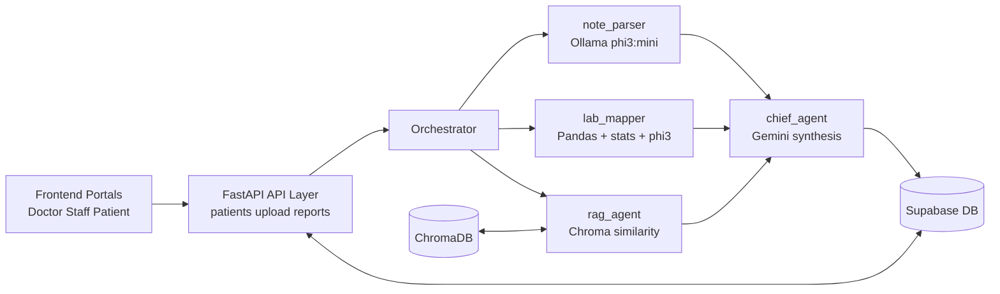

<p align="center">
  
</p>

<h1 align="center">Sanjeevani - Diagnostic Risk Assistant</h1>

<p align="center">
  <strong>Architecture-first multi-agent ICU decision-support platform</strong><br/>
  Team Atrangi · HC01
</p>

<p align="center">
  
  
  
  
  
  
</p>

---

## 1. System Purpose

Sanjeevani is a multi-agent clinical decision-support system that ingests patient files (notes, labs, vitals), builds a unified temporal state, retrieves relevant guideline evidence, and generates structured risk reports.

Primary design objective:

- Provide fast, explainable risk synthesis for ICU workflows.
- Refuse unsafe diagnosis updates when statistically improbable outliers are detected.
- Keep ingestion, analysis, and report delivery deterministic and traceable.

This system is for decision support and clinical workflow augmentation.

---

## 2. Architecture Overview

### 2.1 High-level Diagram (Image)

<p align="center">
  
</p>

### 2.2 High-level Diagram (Text)

```text
Frontend (React)                       Backend (FastAPI)
------------------                     -----------------------------
Staff / Doctor / Patient UI  --->      /upload, /reports, /patients
PIN auth (Supabase tables)             API routes + background tasks
Realtime report views                  |
PDF export                             v
                               Orchestrator (agents/orchestrator.py)
                               |-------------------------------|
                               | Parallel workers              |
                               |  - note_parser (local LLM)    |
                               |  - lab_mapper (stats + LLM)   |
                               |  - rag_agent (Chroma retriever)|
                               |-------------------------------|
                                              |
                                              v
                               chief_agent (Gemini synthesis + guards)
                                              |
                                              v
                               Supabase PostgreSQL (patients, parsed_data,
                               reports, audit/security tables)
```

### 2.3 Mermaid Architecture



---

## 3. Component Responsibilities

### 3.1 API Layer (`backend/api`)

- `main.py`: FastAPI app, middleware, route registration.
- `routes/upload.py`: file ingestion, parse routing, parsed row persistence, optional pipeline trigger.
- `routes/reports.py`: analysis trigger endpoint and current report retrieval.
- `routes/patients.py`: patient creation and retrieval.

### 3.2 Orchestration Layer (`backend/agents/orchestrator.py`)

- Builds patient state.
- Executes worker stages with queueing support for repeated runs.
- Calls chief synthesis.
- Saves report versions and current pointer.

### 3.3 Agent Layer (`backend/agents`)

- `note_parser.py`: extracts symptom signals from unstructured notes.
- `lab_mapper.py`: computes trends, flags outliers, provides narrative context.
- `rag_agent.py`: retrieves guideline citations from local vector store.
- `chief_agent.py`: fuses all signals into final structured report and applies safety guardrails.

### 3.4 Processing Layer (`backend/processing`)

- `file_router.py`: dispatches uploads to parser modules by extension and hint.
- `parsers/*`: CSV/PDF/TXT/JSON specific extraction.
- `state_builder.py`: constructs normalized timeline state from parsed data.

### 3.5 Data Layer (`backend/database`)

- `supabase_client.py`: centralized DB access and report versioning.
- `storage_client.py`: optional object storage upload.
- `schema.sql` and `security_schema.sql`: schema and security policy setup.

### 3.6 Vector Layer (`backend/vector_db`)

- `chroma_setup.py`: initializes persistent Chroma collection.
- `load_guidelines.py`: loads seed and guideline documents into vector store.

---

## 4. End-to-End Data Flow

1. Staff uploads note/lab/vital file via frontend.
2. `/upload/{patient_id}` receives multipart file.
3. File is parsed through `processing/file_router.py` and parser modules.
4. Structured rows are inserted into `parsed_data`.
5. Analysis is triggered (`/reports/analyse` or upload trigger).
6. Orchestrator builds patient timeline state.
7. Worker agents produce:
   - symptoms
   - lab trends and outliers
   - retrieved guideline citations
8. Chief agent generates final report JSON.
9. Outlier safety guard enforces diagnosis hold where required.
10. Report is saved as versioned record; newest marked `is_current=true`.
11. Frontend fetches and renders timeline, risk flags, outlier alerts, and family summary.

---

## 5. Safety and Reliability Design

### 5.1 Outlier Refusal Guard

Three-layer protection:

1. Statistical outlier detection in `lab_mapper`.
2. Mandatory chief prompt instruction to avoid diagnosis update on blocking outliers.
3. Post-generation hard override in `chief_agent` to force `diagnosis_updated=false` when outlier probabilities are blocking.

### 5.2 Versioned Reporting

- Reports are saved as versions, not overwritten.
- Current report pointer (`is_current`) supports stable UI retrieval.

### 5.3 Queueing for Re-analysis

- Repeated analysis requests for same patient are queued to avoid race conditions.

---

## 6. Technology Stack

| Layer | Technology |
|---|---|
| Frontend | React, Vite, Recharts, html2pdf |
| API | FastAPI, Uvicorn |
| Local Model Runtime | Ollama (`phi3:mini`) |
| Cloud Synthesis | Gemini 2.5 Flash |
| Vector Retrieval | ChromaDB + sentence-transformer embeddings |
| Database | Supabase PostgreSQL |
| Data Processing | Pandas, NumPy, PDF parsers |

---

## 7. Repository Structure

```text
Team_Atrangi/
├── backend/
│   ├── api/
│   │   ├── main.py
│   │   ├── models.py
│   │   └── routes/
│   │       ├── patients.py
│   │       ├── reports.py
│   │       └── upload.py
│   ├── agents/
│   │   ├── chief_agent.py
│   │   ├── lab_mapper.py
│   │   ├── note_parser.py
│   │   ├── orchestrator.py
│   │   └── rag_agent.py
│   ├── database/
│   │   ├── schema.sql
│   │   ├── security_schema.sql
│   │   ├── storage_client.py
│   │   └── supabase_client.py
│   ├── processing/
│   │   ├── file_router.py
│   │   ├── state_builder.py
│   │   └── parsers/
│   ├── vector_db/
│   │   ├── chroma_setup.py
│   │   └── load_guidelines.py
│   ├── config.py
│   ├── requirements.txt
│   └── start.py
├── frontend/
│   ├── src/
│   │   ├── App.jsx
│   │   ├── styles.css
│   │   └── lib/
│   └── package.json
├── Logo.jpeg
└── System_architecture.png
```

---

## 8. Quick Start

### 8.1 Backend

```bash
cd backend
pip install -r requirements.txt
python start.py
```

API docs: `http://localhost:8080/docs`

### 8.2 Frontend

```bash
cd frontend
npm install
npm run dev
```

---

## 9. Key API Endpoints

| Method | Endpoint | Purpose |
|---|---|---|
| GET | `/health` | Service health and model config view |
| POST | `/patients/` | Create patient record |
| GET | `/patients/{patient_id}` | Get patient metadata |
| POST | `/upload/{patient_id}` | Upload and parse clinical file |
| POST | `/reports/analyse` | Trigger analysis pipeline |
| GET | `/reports/{patient_id}/current` | Fetch current report |

---

## 10. Operational Notes

- Keep `STORAGE_UPLOAD_ENABLED=false` for DB-first mode when object storage is not required.
- Apply `security_schema.sql` in Supabase before using PIN/audit flows.
- Frontend build warnings about large chunks are optimization concerns, not build failures.

---

<p align="center">
  <em>Sanjeevani - focused architecture for reliable ICU decision support</em>
</p>
